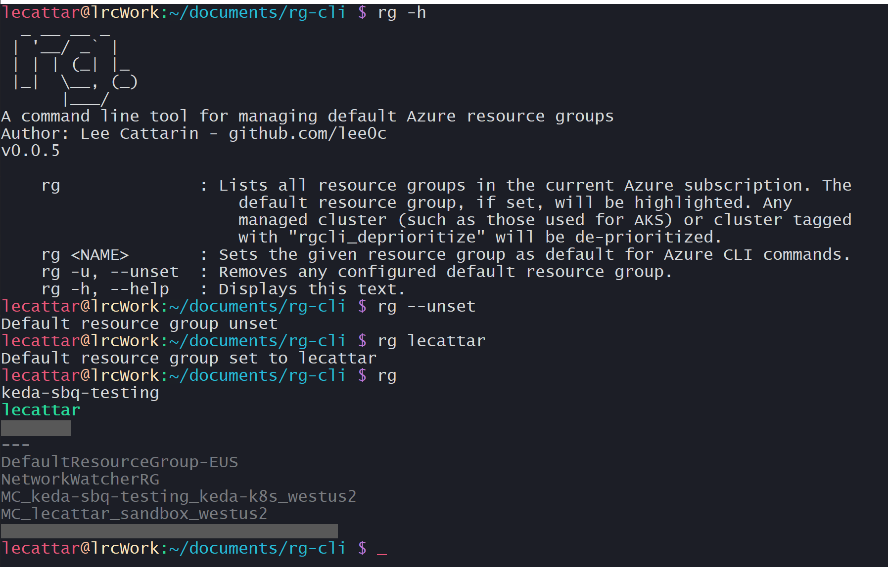

# `rg`



This started as an attempt to use the Azure CLI alias extension in order to easily view resource groups and get/set a default resource group. With those aliases set up, however, I wanted a few more features:

- The ability to not only filter out managed clusters such as those created by AKS from a primary list of resource groups, but also filter out resource groups I had tagged as not interesting or not important. Unless I set a tag on every resource group, querying by tag just resulted in errors due to null objects.
- The ability to combine the `get default resource group` and `view all resource groups` functionalities by showing a list with the current default group highlighted.

## Installation

You must have the Azure CLI set up in the same terminal environment.

Currently, this tool is just a bash script. If you can run a bash script, you can run this. In a Linux environment, the basic steps to set this up are:

```bash
git clone https://github.com/lee0c/rg-cli.git
cd rg-cli
chmod +x rg
ln -s /path/to/rg-cli/rg /usr/local/bin/rg
```

Aka, download this, give it executable permisions, and create a link from your binaries directory to `rg` so you can run it from any directory.

## Use

| Commands | |
| :------- | --- |
| rg | Lists all resource groups in the current Azure subscription. The default resource group, if set, will be highlighted. Any managed cluster (such as those used for AKS) or cluster tagged with "rgcli_deprioritize" will be de-prioritized. |
| rg NAME | Sets the given resource group as default for Azure CLI commands. |
| rg -u, --unset | Removes any configured default resource group. |
| rg -h, --help | Displays help text. |